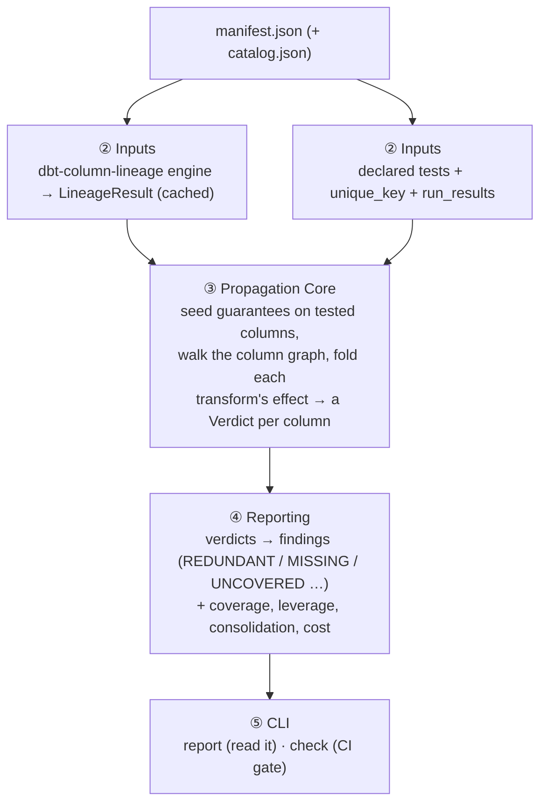
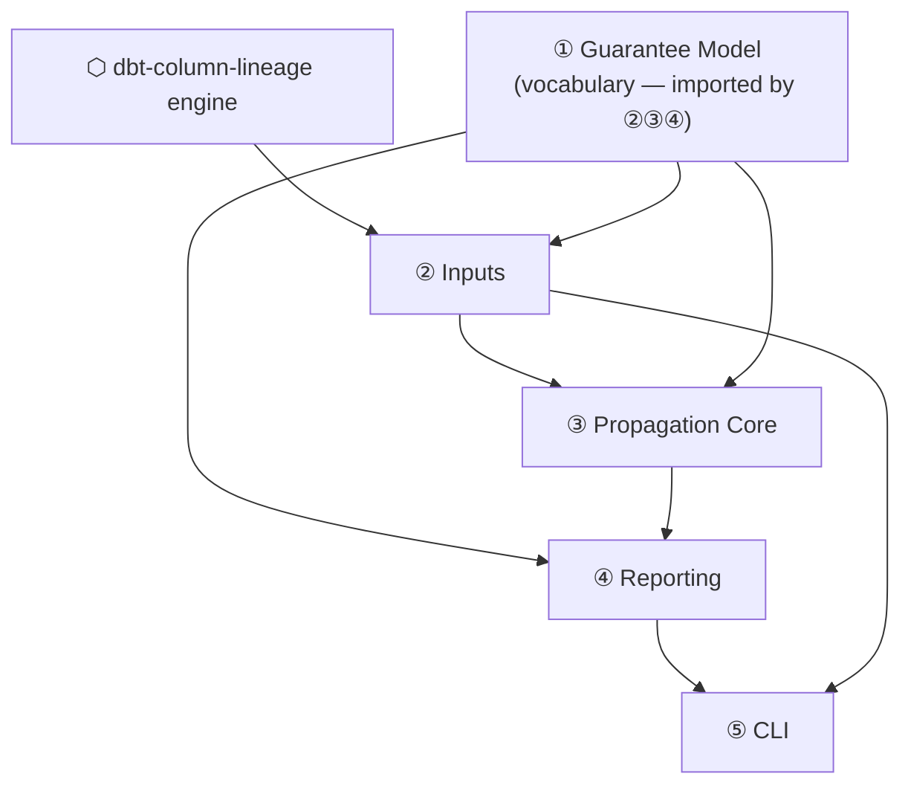

<!-- repo-manual:generated:start -->
# Overview — start here

`dbt-test-lineage` answers one question about a dbt project: **are our `not_null` / `unique` tests doing
anything, and where are we missing some?** It runs no tests and never touches the warehouse. It reads the
project's column-level lineage (from the sibling **`dbt-column-lineage`** engine) plus the tests declared
in `manifest.json`, then **traces each test's guarantee through the transformations** to decide, per
column, whether the guarantee still holds.

The mental model in one line: **facts in → propagate guarantees → verdicts → findings.**

The output is two commands — an advisory `report` and a CI `check` — backed by a report of tests that are
**redundant** (safe to delete), columns that are **missing** coverage, and a few other lenses.
`Sources: [src/dbt_test_lineage/cli.py:152-211]()`

## The 30-second flow

## Systems map

Five systems. This repo is small and flat on disk — these groupings are by **what the code does**, not
which folder it's in. Read them in dependency order (① is a leaf, ⑤ is the root):

| # | System | In one line | Read first if… |
|---|---|---|---|
| **①** | [Guarantee Model](../systems/guarantee-model.md) | the shared vocabulary — `Verdict`, `ColumnVerdict`, `Effect` | you want the words everything else uses |
| **②** | [Inputs](../systems/inputs.md) | where facts come from: cached lineage + declared tests | you're wiring in a new fact source |
| **③** | [Propagation Core](../systems/propagation-core.md) | the brain: fold transforms → a verdict per column | **you're changing the logic — start here** |
| **④** | [Reporting](../systems/reporting.md) | verdicts → actionable findings + coverage/leverage/cost | you're adding a finding kind or metric |
| **⑤** | [CLI](../systems/cli.md) | the two commands a person runs | you're changing flags or output |

Plus **[⬡ the upstream engine](../systems/inputs.md)** (`dbt-column-lineage`) — not in this repo, but
everything sits on its `LineageResult`.

## How the systems connect

The dependency rule worth knowing: **① is a leaf** (depends on nothing) and **⑤ is the root** (depends on
everything). To understand the repo, read ① → ② → ③ → ④ → ⑤. To *change* it safely, the highest-value
code is ③ Propagation Core — the soundness of every finding rests there.

## The one design stance to absorb

Every verdict is **conservative both ways**: the tool claims a guarantee *holds* or is *violated* only
when the recorded facts prove it; otherwise it says `NOT_GUARANTEED` (advisory) or `UNKNOWN`. A false
"this test is redundant, delete it" is worse than a missed one, so the whole system is biased against
over-claiming. That stance is written into the verdict model itself and enforced in ③ Propagation Core.
`Sources: [src/dbt_test_lineage/verdict.py:4-6]()`
<!-- repo-manual:generated:end -->

<!-- repo-manual:human:start -->
<!-- Human notes for this page are preserved across regeneration. Add yours below. -->
<!-- repo-manual:human:end -->
