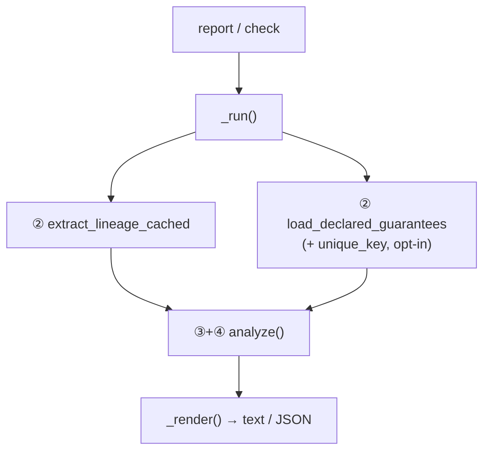

<!-- repo-manual:generated:start -->
# ⑤ CLI

Relevant source files

- [`src/dbt_test_lineage/cli.py`](../../../src/dbt_test_lineage/cli.py)

**Purpose:** the only system a person touches directly. It exposes two Typer commands and wires the other
systems together: drive the engine on a manifest ([② Inputs](./inputs.md)), propagate
([③ Propagation Core](./propagation-core.md)), and render the findings ([④ Reporting](./reporting.md)).
`Sources: [src/dbt_test_lineage/cli.py:1-2]()`

## The shared pipeline

Both commands run the same `_run` helper: extract (optionally cached) lineage, load declared guarantees,
optionally add `unique_key`-implied guarantees, and `analyze`.
`Sources: [src/dbt_test_lineage/cli.py:40-51]()`

## `report` — the advisory view

`report` prints the findings (each with its propagation path), coverage, leverage, consolidation, the
low-confidence count, and — when given `--run-results` — a per-test last-run status and a priced cost of
the removable tests. `Sources: [src/dbt_test_lineage/cli.py:152-189]()` Its flags: `--catalog`,
`--assume-unique-key`, `--run-results`, `--cost-per-hour`, `--limit/-n`, `--cache`, `--json`.

A nice touch in the rendering: redundant tests are annotated *"passing — safe to remove"* vs *"FAIL —
investigate before removing"* from the last run, so the advice is never blind.
`Sources: [src/dbt_test_lineage/cli.py:62-70]()`

> ⚠️ **The cost guardrail.** If the `run_results.json` came from a command that doesn't actually run tests
> (e.g. `dbt docs generate`), the per-test times are compile/catalog time, not test runtime — so `report`
> prints a loud red warning and refuses to treat the cost as meaningful. A cost is never shown without its
> provenance. `Sources: [src/dbt_test_lineage/cli.py:170-182]()`

## `check` — the CI gate

`check` runs the same analysis and exits non-zero **only on provable `CONTRADICTION`s** — with `--strict`,
also on `MISSING` coverage holes. Because `CONTRADICTION` is reserved for the genuinely provable case, the
gate almost never fires on noise. `Sources: [src/dbt_test_lineage/cli.py:192-211]()`

## How it connects

The root of the dependency graph: it imports from [② Inputs](./inputs.md),
[③ Propagation Core](./propagation-core.md) (via [④ Reporting](./reporting.md)), and renders the `Report`.
Nothing imports it.
<!-- repo-manual:generated:end -->

<!-- repo-manual:human:start -->
<!-- Human notes for this page are preserved across regeneration. Add yours below. -->
<!-- repo-manual:human:end -->
