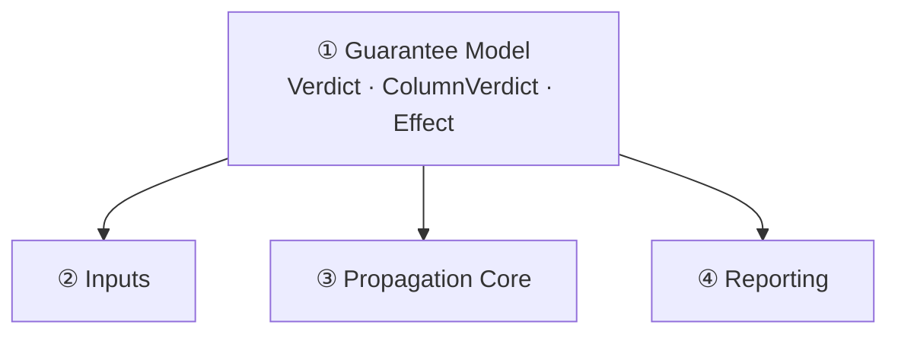

<!-- repo-manual:generated:start -->
# ① Guarantee Model

Relevant source files

- [`src/dbt_test_lineage/verdict.py`](../../../src/dbt_test_lineage/verdict.py)

**Purpose:** define the words. This system is tiny — one ~75-line module — but every other system imports
from it, so it's the right first read. It introduces three ideas: *what guarantee we reason about*, *what
a verdict can be*, and *how a verdict explains itself*.

## The three ideas

**A `GuaranteeKind`** is the kind of dbt test we propagate: `not_null` or `unique` (the MVP).
`Sources: [src/dbt_test_lineage/verdict.py:13-17]()`

**A `Verdict`** is a five-value lattice — and the exact shades matter, because they encode the tool's
entire soundness stance. `Sources: [src/dbt_test_lineage/verdict.py:20-30]()`

| Verdict | Meaning | Acts as |
|---|---|---|
| `PROVEN` | the transforms prove it holds for every row (inherited from upstream) | a guarantee that *holds* |
| `ESTABLISHED` | proven, but **created here** regardless of inputs (`COALESCE` default, `GROUP BY` grain) | a guarantee that *holds* |
| `NOT_GUARANTEED` | the structure **admits** a violation (a null-admitting / non-injective transform on the path) — **advisory, not proof of failure** | a coverage signal |
| `VIOLATED` | the transforms **prove** it cannot hold (rare: literal `NULL`, fan-out duplication) — the only CI-failing verdict | a hard failure |
| `UNKNOWN` | not determinable from the facts (unknown function, no upstream info) | the safe default |

The `.holds` property is the single source of truth for "does the guarantee hold here?" — true only for
`PROVEN` and `ESTABLISHED`. `Sources: [src/dbt_test_lineage/verdict.py:27-30]()`

> ⚠️ **The load-bearing distinction is `NOT_GUARANTEED` vs `VIOLATED`.** Almost nothing is statically
> *provably* null — a `TRY_CAST` *admits* a null without guaranteeing one. So "admits a violation" is
> `NOT_GUARANTEED` (advisory), and `VIOLATED` is reserved for the genuinely provable case. The module
> docstring states the rule plainly: assert a holding/violating verdict only when the facts prove it,
> else emit `UNKNOWN` — "a false `VIOLATED` erodes trust faster than a missed one."
> `Sources: [src/dbt_test_lineage/verdict.py:4-6]()`

## Why every verdict is auditable

A verdict on its own would be a black box. So the model pairs it with its evidence:

- An **`Effect`** is how one step acts on a guarantee as it propagates: `SEED`, `PRESERVE`, `BREAK`,
  `ESTABLISH`, `UNKNOWN`, or `COMBINE`. `Sources: [src/dbt_test_lineage/verdict.py:33-41]()`
- A **`PropagationStep`** is one hop in the explanation — the upstream column, the `Effect`, and a
  human-readable reason (e.g. `"TRY_CAST -> nullable"`). `Sources: [src/dbt_test_lineage/verdict.py:44-51]()`
- A **`ColumnVerdict`** is the whole conclusion for one `(column, guarantee)` pair: the verdict **plus the
  ordered tuple of `PropagationStep`s that explains it**. That tuple *is* the audit trail — no conclusion
  is emitted without a why. `Sources: [src/dbt_test_lineage/verdict.py:54-65]()`

`verdict_to_dict` serializes all of that for the `--json` output.
`Sources: [src/dbt_test_lineage/verdict.py:68-75]()`

## How it connects

A pure **leaf**: it depends on nothing and is imported by everything. Read it in isolation, then move on
to [③ Propagation Core](./propagation-core.md), which produces these verdicts, and
[④ Reporting](./reporting.md), which consumes them.
<!-- repo-manual:generated:end -->

<!-- repo-manual:human:start -->
<!-- Human notes for this page are preserved across regeneration. Add yours below. -->
<!-- repo-manual:human:end -->
