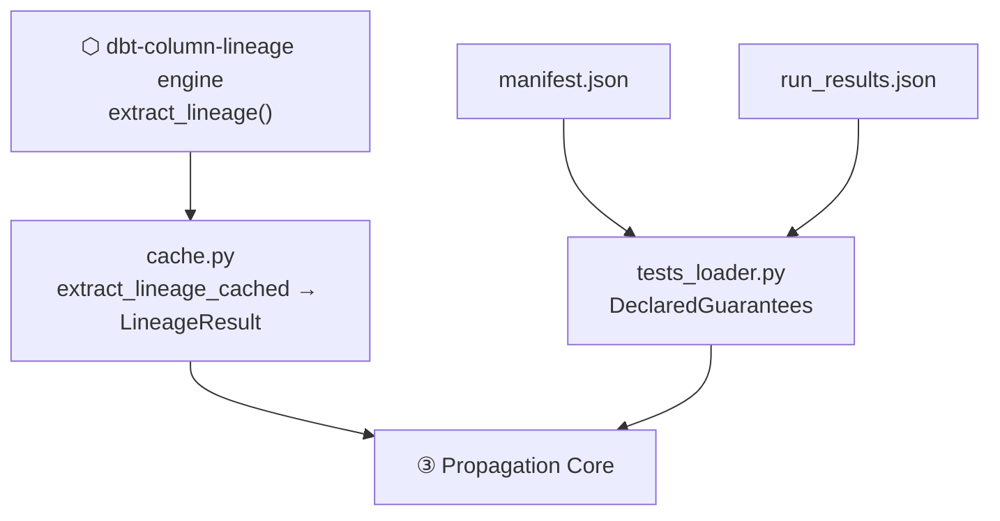

<!-- repo-manual:generated:start -->
# ② Inputs

Relevant source files

- [`src/dbt_test_lineage/cache.py`](../../../src/dbt_test_lineage/cache.py)
- [`src/dbt_test_lineage/tests_loader.py`](../../../src/dbt_test_lineage/tests_loader.py)

**Purpose:** assemble the two fact-streams [③ Propagation Core](./propagation-core.md) needs — *the
lineage* and *the declared tests*. Nothing here makes a judgement; it only loads facts.

## The lineage, cached (`cache.py`)

The lineage comes from the **upstream engine**, called as a library:
`extract_lineage_cached(manifest, catalog, …)` returns `(LineageResult, from_cache)`.
`Sources: [src/dbt_test_lineage/cache.py:28-40]()`

Extraction is the slow part (minutes on a real project), and the analysis on top is seconds — so this
module exists to make iterating on the report instant. The cache key is a SHA-256 of **exactly what the
lineage depends on**: the engine version, the extraction params, and the *contents* of the manifest and
catalog. `Sources: [src/dbt_test_lineage/cache.py:18-25]()` When those are unchanged the pickled result
is returned as-is; when anything changes the key misses and it re-extracts. A corrupt or version-mismatched
cache is silently ignored and rebuilt, never trusted blindly.
`Sources: [src/dbt_test_lineage/cache.py:43-52]()`

> ⚠️ The cache is a local pickle the caller owns — only ever loaded from a path the user explicitly
> passes (`--cache`). `Sources: [src/dbt_test_lineage/cache.py:5-6]()`

## The declared tests (`tests_loader.py`)

dbt generic tests live in `manifest.json` as nodes with `resource_type: "test"`. This module reads them
directly (the engine doesn't surface tests) and turns the MVP kinds into typed
**`DeclaredGuarantee(asset, column, kind, source)`** — where `asset` is the model's `unique_id`, so a
guarantee aligns with a lineage edge directly. `Sources: [src/dbt_test_lineage/tests_loader.py:23-33]()`
`load_test_inventory` keeps the `not_null`/`unique` tests and tallies the rest (table-level, custom,
`accepted_values`/`relationships`) for a coverage denominator.
`Sources: [src/dbt_test_lineage/tests_loader.py:54-69]()`

It also provides three **opt-in / auxiliary** fact sources:

- **`unique_key_guarantees`** — the opt-in config source. It treats a model's `config.unique_key` as
  implied `not_null` + `unique` on the PK (`source="unique_key"`). The soundness care is in the detail: a
  **single-column** key implies both `not_null` and `unique`; a **composite** key implies `not_null` on
  each component *only* — the tuple is unique, not its parts, so a per-column `unique` would be unsound.
  `Sources: [src/dbt_test_lineage/tests_loader.py:153-177]()` It deliberately bails out on expression keys
  like `coalesce(a,b)` it can't map to columns. `Sources: [src/dbt_test_lineage/tests_loader.py:135-150]()`
- **`test_uid_index`** maps `(asset, column, kind) → [test node uids]`, so a finding can be tied back to
  the real dbt test node. `Sources: [src/dbt_test_lineage/tests_loader.py:77-92]()`
- **`load_run_results` / `load_run_timing` / `load_run_metadata`** read a `run_results.json` for per-test
  status, execution time, and **provenance**. The provenance matters: `executed_tests` is true only for
  `dbt build` / `dbt test`, so a cost reading is never taken from a `dbt docs generate` artifact whose
  "times" are compile/catalog time, not test runtime.
  `Sources: [src/dbt_test_lineage/tests_loader.py:105-132]()`

## How it connects

`cache.py` reaches *up* to the engine; both modules feed their facts *down* to
[③ Propagation Core](./propagation-core.md). The `run_results` provenance guardrail is what lets
[⑤ CLI](./cli.md) refuse to print a misleading cost.

> ⚠️ **`--assume-unique-key` is opt-in.** Vanilla dbt does not enforce `unique_key`, so treating it as a
> guarantee is only valid if your project does (e.g. auto-generates the tests for it).
> `Sources: [src/dbt_test_lineage/tests_loader.py:157-161]()`
<!-- repo-manual:generated:end -->

<!-- repo-manual:human:start -->
<!-- Human notes for this page are preserved across regeneration. Add yours below. -->
<!-- repo-manual:human:end -->
