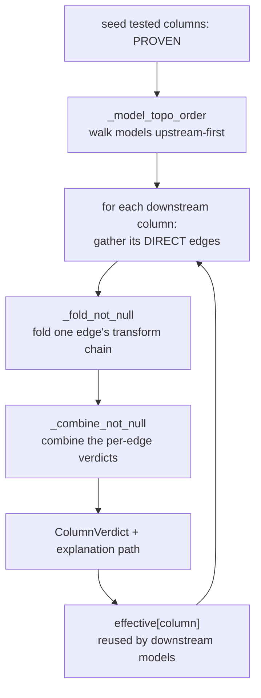

<!-- repo-manual:generated:start -->
# ③ Propagation Core

Relevant source files

- [`src/dbt_test_lineage/propagate.py`](../../../src/dbt_test_lineage/propagate.py) — the walk + combination
- [`src/dbt_test_lineage/rules.py`](../../../src/dbt_test_lineage/rules.py) — the per-transform effect tables

**This is the intellectual heart of the tool — the part to understand first if you change anything.** A
test says "`orders.id` is never null." Three models downstream, that value has been through a `LEFT JOIN`
and a `TRY_CAST`. Does the guarantee survive? This system answers that by **folding the transform chain**:
each transform has a known effect on a guarantee (`rules.py`), and you compose them along the lineage
(`propagate.py`).

The pairing is deliberate: **`rules.py` is the pure lookup ("what does *this one transform* do?") and
`propagate.py` is the walk ("compose those effects over the whole graph").**

## `rules.py` — the effect tables

`not_null_effect(step)` maps one engine `TransformStep` to a `verdict.Effect`. The lattice trick that
makes the whole thing cheap: `BREAK` / `ESTABLISH` / `UNKNOWN` are **constants** and `PRESERVE` is the
**identity**, so folding a chain reduces to "the last non-`PRESERVE` step wins."
`Sources: [src/dbt_test_lineage/rules.py:56-89]()`

| Transform | Effect on `not_null` | Why |
|---|---|---|
| `IDENTITY` / `RENAME` | `PRESERVE` | the value is untouched |
| `CAST` | `PRESERVE`, but **`TRY_CAST` → `BREAK`** | a safe cast yields `NULL` on failure |
| `COALESCE` (non-null default) | `ESTABLISH` | non-null regardless of the threaded column |
| `CASE` with `ELSE NULL` | `BREAK` | the else-branch admits a null |
| `AGGREGATION` / `WINDOW` | `ESTABLISH` for `COUNT`/`ROW_NUMBER`-style, else `UNKNOWN` | only a vetted allowlist is provably non-null |
| `JOIN` (introduces nulls) | `BREAK` | the outer side of an outer join |
| anything unrecognised | `UNKNOWN` | **never a false `BREAK`** |

The soundness discipline is visible in the conservative allowlists: only a curated set of scalar
functions is treated as null-preserving, and a `COALESCE` default counts as non-null only when it is
*unambiguously* a literal (parenthesised/nested expressions never match).
`Sources: [src/dbt_test_lineage/rules.py:37-53]()`

For `unique`, `rules.py` exposes `is_injective_chain` — true only for passthrough/structural steps.
**`CAST` is deliberately excluded**: a narrowing cast (float→int, timestamp→date) can collapse distinct
values, and we can't tell from the type alone, so we never claim uniqueness survives a cast.
`Sources: [src/dbt_test_lineage/rules.py:98-107]()`

## `propagate.py` — the walk

The entry point `propagate(result, guarantees, kind)` dispatches to the `not_null` or `unique` walk.
`Sources: [src/dbt_test_lineage/propagate.py:198-208]()` A key design choice frames everything: a column's
verdict is **computed from its inputs and transforms only — it does not count the column's own test** —
so [④ Reporting](./reporting.md) can compare "what dbt asserts here" against "what the lineage proves."
`Sources: [src/dbt_test_lineage/propagate.py:7-10]()`

### not_null: fold, then combine

1. **Fold one edge** (`_fold_not_null`): apply each step's `Effect` in order; record every step for the
   explanation. A `BREAK` lands on "admits a null" — **`NOT_GUARANTEED`, not `VIOLATED`** — and anything
   unrecognised on `UNKNOWN`, never a false alarm. `Sources: [src/dbt_test_lineage/propagate.py:111-131]()`
2. **Combine multiple edges** (`_combine_not_null`) — the subtlest code in the file. `COALESCE` arguments
   combine by **OR** (`_or`: holds if *any* holds); `UNION` branches and everything else combine by
   **AND** (`_and`: any input that admits a null makes the result admit one).
   `Sources: [src/dbt_test_lineage/propagate.py:181-195]()` The OR/AND helpers themselves:
   `Sources: [src/dbt_test_lineage/propagate.py:137-160]()`
3. **Seed and carry** (`_propagate_not_null`): roots start `PROVEN` if tested, else `UNKNOWN`; the value
   handed downstream is `PROVEN` whenever the column is itself tested (dbt enforces that test at runtime).
   `Sources: [src/dbt_test_lineage/propagate.py:224-241]()`

### unique: key-sets, not single columns

Uniqueness is a property of *sets* of columns, so `_propagate_unique` tracks each model's **set of unique
key-sets** — a single-column `unique` test on `C` holds iff `{C}` is one of them. Keys are **established**
from a `GROUP BY` grain or `SELECT DISTINCT`, and **inherited** through injective passthrough only when
the model does *not* multiply rows; a unique-upstream column in a row-multiplying model becomes
`NOT_GUARANTEED` (a *may* duplicate, not a *does*).
`Sources: [src/dbt_test_lineage/propagate.py:248-321]()`

### A side channel: lineage confidence

`column_confidence` is an orthogonal, kind-independent pass that rates how much to trust the *lineage
itself* under a column — `LOW` if any incoming edge has an `UNKNOWN` transform, an unresolved schema, or
an engine warning, propagated downstream so uncertainty is inherited.
`Sources: [src/dbt_test_lineage/propagate.py:62-91]()` [④ Reporting](./reporting.md) attaches it to each
finding's `confidence`.

## Decisions & gotchas — read before changing

- ⚠️ **`NOT_GUARANTEED` ≠ `VIOLATED`.** A `BREAK` admits a null; it does not prove one. Equating them
  produced 47 false alarms on a real repo. `Sources: [src/dbt_test_lineage/propagate.py:126-129]()`
- ⚠️ **The multi-edge combination (`COALESCE`=OR, `UNION`/`CASE`=AND) is the fragile spot** — it relies on
  the engine's transform details (`COALESCE` markers, `UNION` branch index).
  `Sources: [src/dbt_test_lineage/propagate.py:174-195]()`
- ⚠️ **`unique` excludes `CAST` from injective chains** on purpose (a narrowing cast can collapse values).
  `Sources: [src/dbt_test_lineage/rules.py:94-100]()`
- ⚠️ **Cycles still terminate** — `_model_topo_order` appends any node left in a cycle at the end.
  `Sources: [src/dbt_test_lineage/propagate.py:38-59]()`

## How it connects

Reads the vocabulary from [① Guarantee Model](./guarantee-model.md); consumes the `LineageResult` +
declared guarantees from [② Inputs](./inputs.md); feeds its `{column → ColumnVerdict}` map to
[④ Reporting](./reporting.md).
<!-- repo-manual:generated:end -->

<!-- repo-manual:human:start -->
<!-- Human notes for this page are preserved across regeneration. Add yours below. -->
<!-- repo-manual:human:end -->
