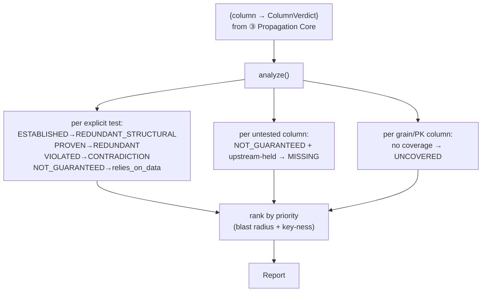

<!-- repo-manual:generated:start -->
# ④ Reporting

Relevant source files

- [`src/dbt_test_lineage/reports.py`](../../../src/dbt_test_lineage/reports.py)

**Purpose:** turn the per-column verdicts from [③ Propagation Core](./propagation-core.md) into the
**actionable findings** a person acts on, plus the coverage/leverage/consolidation/cost numbers around
them. `analyze(result, guarantees, kinds)` is the one entry point; it returns a `Report`.
`Sources: [src/dbt_test_lineage/reports.py:135-251]()`

## The finding kinds

The whole report is biased toward what it can prove — a false alarm costs more than a miss — so the kinds
are carefully separated. `Sources: [src/dbt_test_lineage/reports.py:43-48]()`

| Kind | Fires when… | So you can… |
|---|---|---|
| `REDUNDANT` | a tested column is `PROVEN` — inherited from an **upstream** test through preserving transforms | drop the re-test, keep the upstream one |
| `REDUNDANT_STRUCTURAL` | a tested column is `ESTABLISHED` — **this model's own SQL** guarantees it (`GROUP BY`, `COALESCE`…) | drop a test the structure already enforces |
| `MISSING` | an **untested** column is `NOT_GUARANTEED` *and the guarantee existed upstream and was dropped here* | plug a real coverage hole |
| `UNCOVERED` | a single-column **grain/PK** with no guarantee anywhere in its lineage | cover a key that has zero protection |
| `CONTRADICTION` | a tested column is the (rare) provable `VIOLATED` | the only CI-failing finding |

A subtlety worth internalising: a *tested* column that is merely `NOT_GUARANTEED` is **not** a finding —
the test is load-bearing, doing real work. It's surfaced only in the informational `relies_on_data` count.
`Sources: [src/dbt_test_lineage/reports.py:16-17]()` And findings are reported only on **explicit** tests
(removable test nodes), not config-implied guarantees.
`Sources: [src/dbt_test_lineage/reports.py:181-208]()`

## The numbers around the findings

- **Coverage** (per kind): of every column the lineage reaches, how many are covered (tested or
  structurally guaranteed) — both a raw count and an **importance-weighted** one, where a high-blast-radius
  or PK column counts for more. `Sources: [src/dbt_test_lineage/reports.py:170-179]()`
- **Leverage** (`_reach`): how far each test's guarantee actually reaches downstream before some transform
  kills it — low reach means the test guards little. `Sources: [src/dbt_test_lineage/reports.py:122-132]()`
- **Consolidation** (`_anchor`): climb upstream through holding columns to the nearest declared guarantee,
  so a chain of redundant re-tests can collapse onto one anchor.
  `Sources: [src/dbt_test_lineage/reports.py:105-119]()`
- **Cost** (`redundant_cost`): price the removable tests from `run_results` `execution_time` — seconds, a
  share of total test time, optionally in dollars. `Sources: [src/dbt_test_lineage/reports.py:268-290]()`

Every finding carries a `priority` (key-ness + blast radius, so the list sorts worst-first) and a
`confidence` (inherited from ③'s lineage confidence — `LOW` findings rest on uncertain lineage).
`Sources: [src/dbt_test_lineage/reports.py:238-251]()`

## The careful bits — read before changing

- ⚠️ **`MISSING` only fires when the guarantee actually existed upstream and was dropped here**, not for
  every untested nullable column — that's the difference between a real hole and noise.
  `Sources: [src/dbt_test_lineage/reports.py:210-221]()`
- ⚠️ **`UNCOVERED` is scoped to single-column grains** (a model's natural PK) so the list stays
  actionable; the whole-population picture is the `coverage` stat instead.
  `Sources: [src/dbt_test_lineage/reports.py:144-147]()`

## How it connects

Consumes the verdict map (and `column_confidence`) from [③ Propagation Core](./propagation-core.md);
its `Report` is rendered by [⑤ CLI](./cli.md).
<!-- repo-manual:generated:end -->

<!-- repo-manual:human:start -->
<!-- Human notes for this page are preserved across regeneration. Add yours below. -->
<!-- repo-manual:human:end -->
